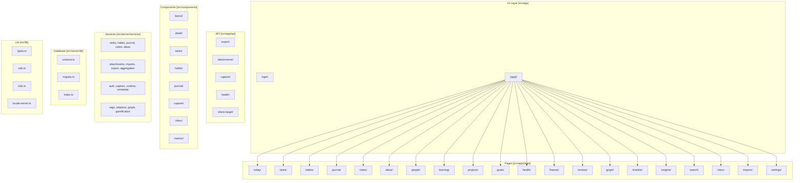

# lifeOS - AI Context

> Self-hosted, open-source personal Life Operating System

## 架构总览 (Mermaid)



## 模块索引

| 模块 | 路径 | 说明 |
|------|------|------|
| **Pages** | `src/app/(app)/` | 39 个页面路由 |
| **API** | `src/app/api/` | 6 个 API 路由 |
| **Services** | `src/server/services/` | 46 个业务服务 |
| **Components** | `src/components/` | 22 个组件 |
| **Database** | `src/server/db/` | Drizzle ORM + SQLite |
| **Lib** | `src/lib/` | 类型、工具、i18n |

## 技术栈

| 层级 | 技术 |
|------|------|
| Framework | Next.js 15 (App Router, Server Components, Server Actions) |
| Language | TypeScript (strict) |
| Database | SQLite via better-sqlite3 + Drizzle ORM |
| Search | SQLite FTS5 |
| Styling | Tailwind CSS |
| Editor | TipTap (Markdown) |
| Icons | Lucide React |

## 数据库架构

**25+ 表**：tasks, habits, habitCompletions, journalEntries, notes, ideas, projects, goals, milestones, metricLogs, entities, events, reviews, templates, attachments, attachmentLinks, importRuns, importedRecords, scheduledJobs, jobRuns, inboxItems, relations, tags, itemTags, gamificationProfile, xpEvents, achievements, appSettings

**关键设计**：
- ULID 主键（时间可排序）
- 共享 tags + relations 层（跨域连接）
- SQLite FTS5 全文搜索

## 全局规范

### 文件组织
```
src/
├── app/           # Next.js App Router 页面
├── api/           # API 路由
├── components/    # React 组件（按功能分组）
├── server/        # 服务层（业务逻辑 + 数据库）
├── lib/          # 共享工具（类型、i18n、utils）
└── stores/       # 客户端状态管理
```

### 命名约定
- 文件：`kebab-case`（kebab-case.tsx）
- 组件：`PascalCase`（ComponentName.tsx）
- 数据库表：`snake_case`（drizzle schema）
- 服务函数：`camelCase`（serviceName.ts）

### 开发命令
```bash
npm run dev       # 开发服务器
npm run build    # 生产构建
npm run lint     # ESLint 检查
npm run typecheck # TypeScript 检查
npm run db:migrate # 数据库迁移
npm run test     # 测试
```

## 已生成文档

- ✅ `CLAUDE.md` - 根级架构总览
- ✅ `src/server/services/CLAUDE.md` - 46 个服务详细索引
- ✅ `src/components/CLAUDE.md` - 22 个组件分类
- ✅ `src/app/(app)/CLAUDE.md` - 39 个页面路由